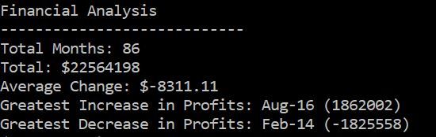
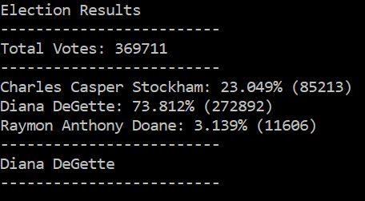

# Python-Analysis

### Dependencies
<ul>
Libaries:
<li> os </li>
<li> csv </li>
</ul>

##  PyBank and PyPoll

### Background and overview

This set out challenge required us to create two script to interpret and formulate over two different sets of data.

scripts created to analyse the financial records of a company. 

## PyBank

Using the following dataset: (PyBank/Resources/budget_data.csv). 
The dataset is composed of two columns: "Date" and "Profit/Losses". Using this data I have extracted the following details:
<ul>
<li>The total number of months included in the dataset</li>
<li>The changes in "Profit/Losses" over the entire period, and then the average of those changes</li>
<li>The net total amount of "Profit/Losses" over the entire period</li>
<li>The greatest increase in profits (date and amount) over the entire period</li>
<li>The greatest decrease in profits (date and amount) over the entire period</li>
</ul>

The output is displayed in the terminal as well as output via a text file.

### Output

## PyPoll

To assist a small town with their electoral voting system, a python script was written to import a raw CSV file containing the voting data and output valuable information, listed below.

Using the following dataset: (PyPoll/Resources/election_data.csv). The dataset is composed of three columns: "Voter ID", "County", and "Candidate".
Using this data I have extracted the following details:

<ul>
<li>The total number of votes cast</li>
<li>A complete list of candidates who received votes</li>
<li>The percentage of votes each candidate won</li>
<li>The total number of votes each candidate won</li>
<li>The winner of the election based on popular vote</li>

The output is displayed in the terminal as well as output via a text file.

### Output

-----------------------------------------------------------------------------
-----------------------------------------------------------------------------

Attacking both of these scripts, I wanted to approach the construction of the code in a way that utilized functions, dictionaries and lists where and when possible. 

I also wanted to construct the code with the idea of future revisions in mind, incorporating a singular results list that was used to output both on the terminal and text file. This  meant that if, in future, the output needed to be changed - only a singular function has to be updated. 
